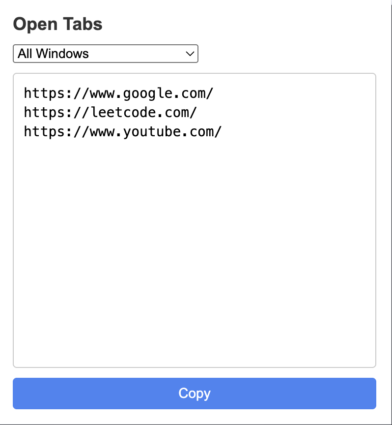

# Chrome Tabs Copier

A Chrome extension that allows you to easily copy URLs from all your open tabs with just one click. Perfect for sharing multiple links or saving them for later use.



## Features

- 📋 Copy URLs from all open tabs with a single click
- 🪟 Filter tabs by specific Chrome windows
- 💨 Quick and lightweight popup interface
- 📝 Clean and organized output format
- 🎯 Easy-to-use dropdown window selector
- ✨ Visual feedback on copy action

## Installation

### From Chrome Web Store
*(Coming soon)*

### Manual Installation (Developer Mode)

1. Download or clone this repository to your local machine
2. Open Chrome and navigate to `chrome://extensions/`
3. Enable "Developer mode" in the top right corner
4. Click "Load unpacked" button
5. Select the folder containing the extension files
6. The extension icon will appear in your Chrome toolbar

## Usage

1. Click the extension icon in your Chrome toolbar to open the popup
2. Use the dropdown menu to select:
   - "All Windows" to see URLs from all open windows
   - A specific window to see only tabs from that window
3. Click the "Copy" button to copy all displayed URLs to your clipboard
4. Paste the URLs anywhere you need them

## Technical Details

The extension is built using:
- Manifest V3
- Vanilla JavaScript
- Chrome Extensions API
- HTML/CSS for the interface

### Permissions Required
- `tabs`: To access the URLs of open tabs
- `windows`: To distinguish between different Chrome windows

## Project Structure

```
chrome-tabs-copier/
├── manifest.json        # Extension manifest file
├── popup.html          # Main popup interface
├── popup.js            # Core functionality
├── styles.css          # UI styling
├── icon48.png          # Small icon
├── icon128.png         # Large icon
└── README.md           # Documentation
```

## Development

To modify the extension:

1. Clone the repository
```bash
git clone https://github.com/yourusername/chrome-tabs-copier.git
```

2. Make your changes to the source files
3. Test the extension by loading it in Chrome
4. Reload the extension in `chrome://extensions/` to see your changes

## Contributing

Contributions are welcome! Feel free to:
- Report bugs
- Suggest new features
- Submit pull requests

## License

This project is licensed under the MIT License - see the [LICENSE](LICENSE) file for details.

## Version History

- 1.0.0 (2024-03-XX)
  - Initial release
  - Basic tab URL copying functionality
  - Window selection feature
  - Copy to clipboard with visual feedback

## Acknowledgments

- Thanks to the Chrome Extensions team for the excellent documentation
- Icons created using standard material design guidelines

## Contact

If you have any questions or suggestions, please open an issue in the repository.

---

Made with ❤️ for Chrome users who need to manage multiple tabs efficiently 